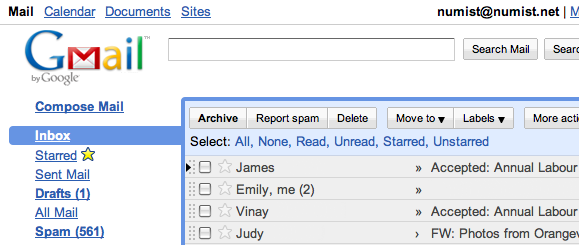
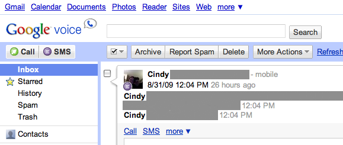
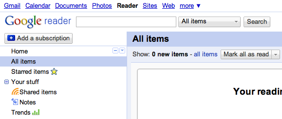

I love what Google has shipped.

Search surprised the world (or at least Yahoo!), GMail turned the world of webmail upside-down, Maps effectively launched web2.0, and part of their success has been their spartan yet functional design. I like it, but for a company focused on engineering, the various apps' interfaces (Mail, Voice, Reader, Calendar, for today's example) all differ from each other in noticeable and annoying ways.

<caption>GMail acting as a reference.</caption>

<caption>Calendar: search button is a different shape, now search options is a link, not a button. </caption>

<caption>Voice: now items selected in the sidebar extend all the way to the edge of the page.</caption>

<caption>Reader: this is actually very similar to voice, but reader has internal inconsistencies. notice the icon placement in the sidebar: half on the right, half on the left. Trends next to Notes is especially annoying.</caption>

while it still feels like I'm using a Google app, flipping between sites makes them feel sloppy.

it brings to mind the [blog post Douglas Bowman made](http://stopdesign.com/archive/2009/03/20/goodbye-google.html) when he quit Google. as a classical designer, it must have been hard to function in such an engineering-oriented company. still, I have to wonder how UI inconsistencies between apps (and within them) can take a back seat to [investigating shades of blue](http://www.nytimes.com/2009/03/01/business/01marissa.html?_r=1&adxnnl=1&pagewanted=print&adxnnlx=1251965002-g/Lw1H22m/zj1u/7BlfHIQ).

at the end of the day, Google stores my mail, appointments, phone activity, and feeds. I appreciate the emphasis on a solid infrastructure and wouldn't trade it for better design.
