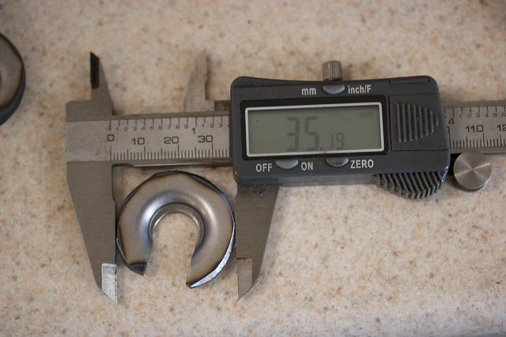
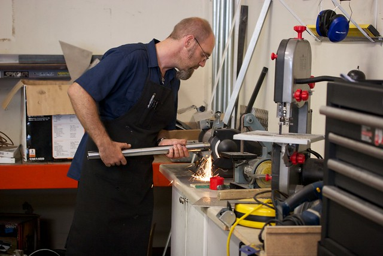

Just to get it out of the way now, this mod irreversibly modifies your fork caps and fork tubes.  You will need access to some specialty tools (like a lathe) that you probably don't have in your garage, which is why we did this in a suspension shop.  The point of this mod was not to be as simple and easy as possible (though it's much less involved than a lot of other front end work people have done here), but to stay as close to stock as possible.  The bike still uses the same legs and tubes, the only thing that gives away the hackery within is the fork caps, which picked up a damping adjustment screw:

Some parts had to be milled, ground, and invented.  Here they are:

## fork caps

In the background is an unsullied GSX-R cap.  To make the monstrosity in the foreground, a GSX-R cap was milled down, and one of the SV caps milled out.  They're pressed together, and then welded just to be sure they don't come apart.

## lower spacer

At the other end of the cartridges, the length is about 2" too short (as anyone with a GSX-R front end swap is well aware) and the thread pitch is different. Building custom spacers solves both problems at once.

When you install these, make sure to use thread locker.  The last thing you want is to be undoing the lower retaining bolt and instead unscrewing the spacer from the cartridge, leaving it stranded in the fork leg.  Lock this thing in.

## spring retaining washer

This one's simple.  Didn't fit in the SV tube.  Grind it down to the neighbourhood of 35mm and you're good.  Don't worry too much about tolerances, all it has to do is hold a bunch of washers on the top of a loaded spring.

[not pictured]

Not shown here is the compression valve.  The dirty secret of this mod is that the SV, unlike the GSX-R, doesn't have a compression damping adjuster screw at the bottom of the fork.  To get around this the compression valve was drilled with an extra, scientifically measured hole (1mm) to set the low-speed compression to about a full turn away from max.  If you use Suzuki valves, expect to break a few making this hole (they're made with a brittle plastic, Robert says he killed three on the drill press).  Try using Race Tech valves instead, they're made out of aluminum.

## top out spring

If you don't want to read this section, here's what you need to know: use a cartridge from a USD fork.

The RSU (right side up) GSX-R forks have a top out spring on the outside of the cartridge (top of picture) which doesn't clear the bottom of the SV tube.  Even if it did it would be too close to the walls, restricting oil flow in the fork.  The USD cartridges on the GSX-Rs use internal top out springs and the cartridges are similar enough that you can retrofit internal top out springs into an RSU cartridge, at which point you're just left with the spring collar (bottom of picture).

Hey, when you've got a box of spare parts and a curious mind…

## disassemble

If you're looking at this post as a step-by-step guide, here's the part where you take the forks out (we had spare caps to build the cartridge caps).  Follow the service manual as if you were changing the fork seals or springs—on a damping rod fork everything must go to do this.

## modifying the tubes

Just inside the bottom of the tube, you can see a plastic ring and a metal collar behind it with 4 metal tabs holding the plastic in.  They're in the way of the cartridge and have to go.

At the bottom of the tube is this metal piece that mates to the damping rod when you bottom out, increasing damping resistance.  It's a cute design but it adds damping to the cartridge setup as well by making the tube fit too tightly to the cartridge.  The cartridge fits, but the extra damping is very bad.

These unwanted pieces are all stacked inside the tube, which is peened over at the end.

This is Robert.  He started [Evolution Motorcycles](https://evolution-motorcycles.com) and came up with the idea to do this.  He did all the work while I got in the way (and made a mess).  ~~If you have a harebrained project idea and you're near San Jose, he's probably the man for the job.  His next shop project is to attach a big BMW sidecar (found on craigslist, natch) to a Hayabusa so he can ride around with the shop dog.~~[^robert]

Anyway, grind the tube to get rid of the peened surface, as shown above.

Then set up the tube in a vise and put a piece of metal stock inside that can be used to punch out the metal ring with the tabs.

The pieces in the tube are a pretty tight fit, so don't be afraid to give it hell.

Oh yeah, there's also a little tiny spring in there.  Surprise!

Here are what the metal tab thing, spring, and damping rod grommet all look like outside of the tube.  That plastic thing from the earlier picture is in a dozen small pieces on the floor, it couldn't take the hammering.

Make sure to sand and file the end of the tube at this point, it's a bit ragged.

## old and new

In case you haven't seen your damping rod before (I hadn't), here's a few pictures of what came out and what went in:

## installation

Cartridge forks are much easier to work on, with the active parts of the suspension bolted together there's only one thing to take out of your fork instead of the half dozen pieces of metal that fell out when we started disassembly.

So put the tube and leg back together, press the seal, set the clip, set the dust cap, drop in the cartridge, bolt it at the bottom, fill with oil, bleed the cartridge, drop in the spring, capture the spring with spacers and the retaining washer, put on the cap, repeat.

## but do they work?

I really like the new ride, there's a very noticeable difference once things are dialed in (though to be fair, there was a difference when the low speed damping was set too low as well.  Make sure your suspension is adjusted correctly!).  I won't have a full measure of what the bike can do until my Penske arrives (zoran says it's in the mail this week), but initial impressions are very, very positive.

If you're feeling a little out of your mind, and want to keep that stock look (and stock rake, trail, and speed sensor) this is a good mod.  If there's enough interest, I might even work with Robert to package a kit, so speak up.

[^robert]: Rob has moved on; Evolution is still good though.