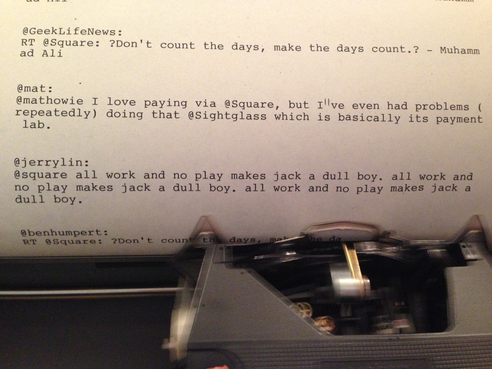
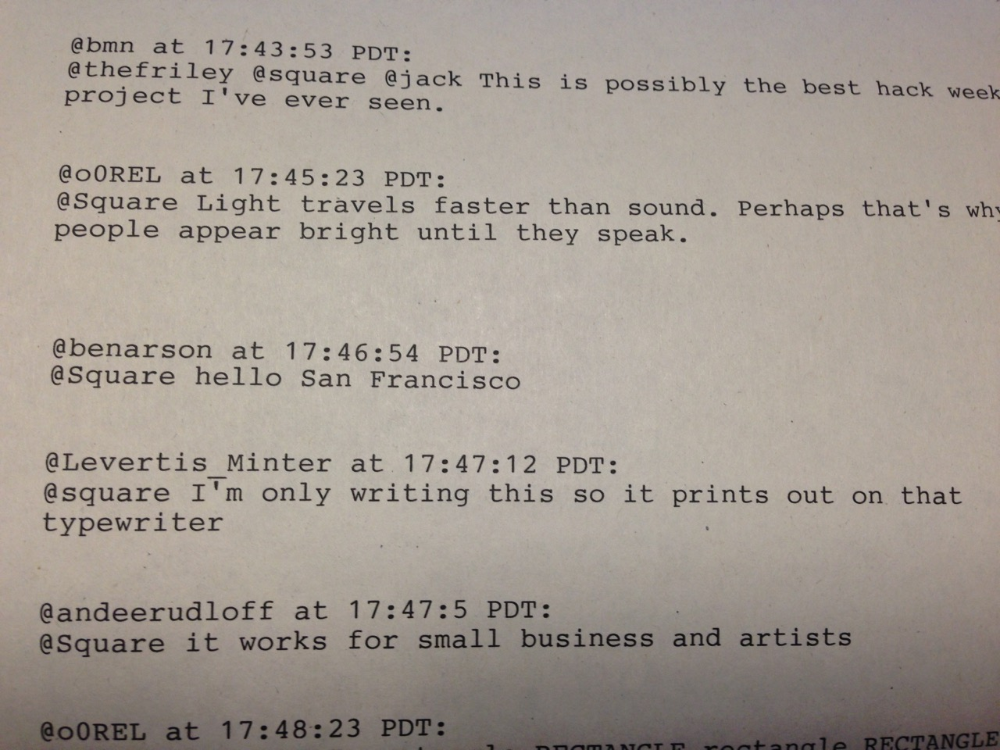

In 2010 I [turned a typewriter into a serial teletype for fun](http://numist.net/post/2010/project-typewriter.html) but it has collected dust ever since, just one more thing to pack whenever I've moved. Each quarter, Square sets aside a full week for everyone in the company to build something self-directed and this time seemed like a good opportunity to dust it off and do something fun.

At Square our office is littered with [inforads, or "information radiators"](https://developer.squareup.com/blog/inside-a-square-inforad/). They're mostly column-mounted televisions displaying web pages that show things like a world map annotated with transactions as they happen, or <abbr title="Gross Payment Volume">GPV</abbr> graphs, or whatever. Omnipresent dispensaries of interesting business information. An automated typewriter seemed like a natural kind of inforad, but what would it print?

Well, tweets of course. Specifically, anything that mentioned the @Square account.

It worked great and [I wrote a blog post about it for The Corner](https://developer.squareup.com/blog/the-square-tweetwriter/). You should check that out because the rest of this post is more of a supplement than a reprise.

People had a lot of fun with it from the start, tweeting funny messages and then wandering over to the coffee bar to see their text clatter to life:

Once it went public, people out in the world seemed to enjoy sending their messages directly into the office:

Extra thanks to Ben Novakovic for the "best hack week project" nomination:

<!--<blockquote class="twitter-tweet">
@thefriley @square @jack This is possibly the best hack week project I&#39;ve ever seen.
&mdash; Ben Novakovic (@bmn) <a href="https://twitter.com/bmn/status/371070320251125760">August 24, 2013</a></blockquote> -->

Like any idea with a week's worth of effort, it had a couple shortcomings. For example if the @Square account tweeted something popular, the typewriter would faithfully—and noisily—relay every single retweet:

But overall it was a fun project and it felt good to give the typewriter something to do with itself.

The [source code is available](https://github.com/numist/Tweetwriter) in case you also happen have an output device that speaks serial and desperately wants to create a physical record of the internet as it transpires. I hope you do.
