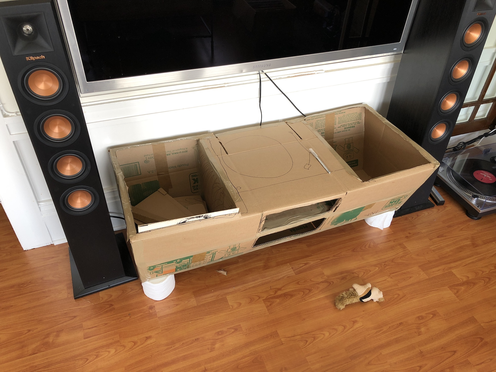
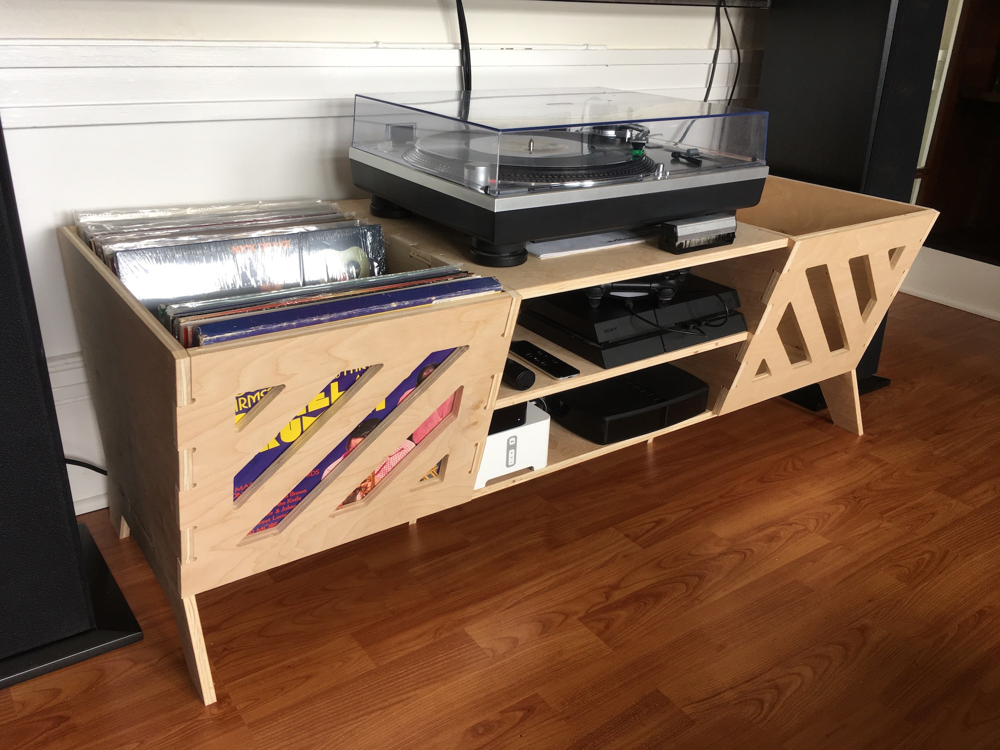

A while ago some friends gifted us a small record collection along with a broken record player, which I was able to revive with some dubious electrical engineering. During the holidays, Tanya gifted me a nicer record player. Next I needed a place to keep these things.

Record sleeves are just over 12¼" square (I rounded up to 13"), and the internet has mostly agreed to store them within 15° of vertical. A bit of measuring on the new record player and we were ready to move on to some Cardboard Aided Design:

Full scale models are really useful when designing furniture. Not only can you double check measurements with your real-world references (in this case, a bunch of records and a turntable), but you can get an idea of what it's like to live with it in your space.

For 11 months.

The _Computer_ Aided Design actually went pretty quickly once I stopped procrastinating and spent a couple evenings learning how Fusion works.

And after a couple late nights in our crawlspace workshop, it was done:

If you've got a 2½D CNC that understands SVG—like the Shaper Origin—you can get the cutfiles [here](Media%20Center.zip).
