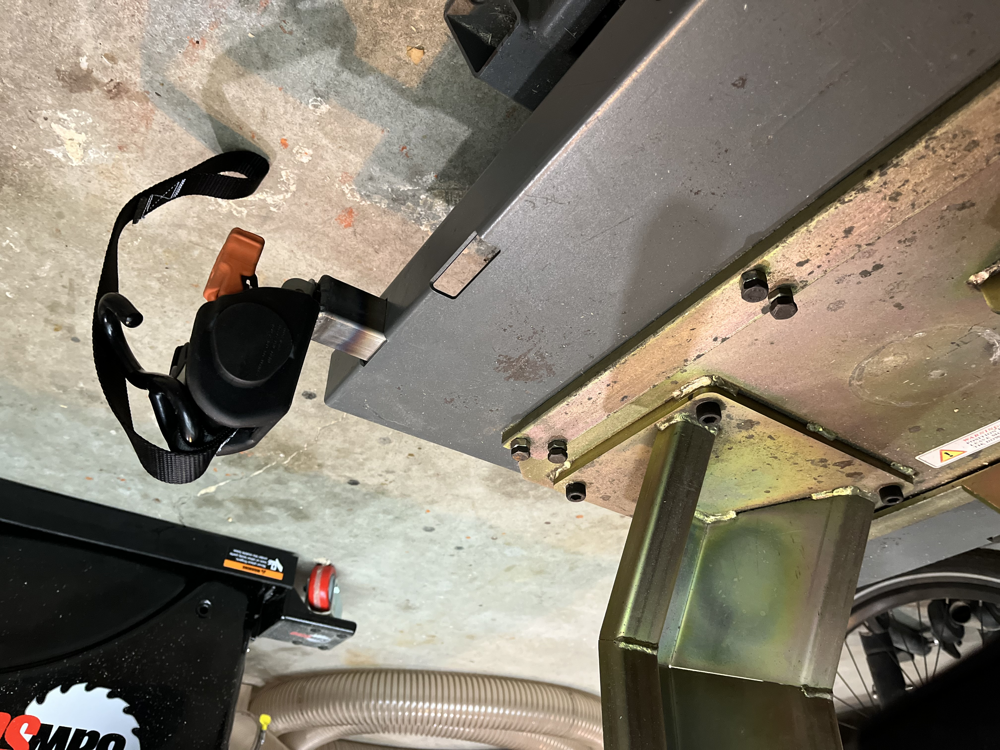

I got a set of [CargoBuckle](https://www.imminet.com/products/tie-downs/cargobuckle/)s. They're basically ratchet straps with a seatbelt retractor built in.

They're great, but two mods make them even better for securing bikes to a lift:

1. Fork loops:
   
    
    
2. Square tube mount (shown partially-inserted):
    
    
