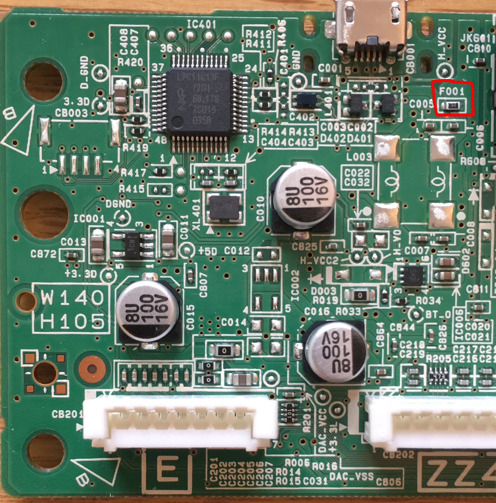

We got a Yamaha PSS-A50 for our kiddo. He loves banging away on it, I love that it's an order of magnitude cheaper than my OP-1.

Then the next day it wouldn't turn on. I took it apart to see if there were any obvious burn marks (or drool), but everything looked clean. I still had the receipt, and the staff at The Starving Musician in Berkeley were happy to exchange it for another.

It's been a few months, and now the replacement won't turn on either. [Apparently this is a common problem](https://www.reddit.com/r/synthesizers/comments/kjzwj5/my_yamaha_pss_a50_wont_turn_on/). Luckily, the board's components are extensively labeled and [Stephen Griffiths already found the board's fuse](https://stegriff.co.uk/upblog/fixing-a-yamaha-pss-a50-that-wont-switch-on/) (photo his, see top right):

Like Stephen, our keyboard's F001 also failed continuity. Luckily, I _do_ have a current-limiting power supply so we were able to bridge the fuse and safely power the keyboard on.

For the curious, the keyboard mostly draws 100mA±20 (at 6V), though there was a spike (~200mA) when the power button was held. We tried holding down various combinations of keys and buttons but other than initial power-on we never saw more than ~120mA so we have no idea what blew the fuse in the first place. Worse, [Jesse](https://fsck.com) found the part (it's a [1206L110TH](https://m.littelfuse.com/~/media/electronics/datasheets/resettable_ptcs/littelfuse_ptc_1206l_datasheet.pdf.pdf)) and it's supposed to be self-resetting with a trip current of 1.1A. Did Yamaha get a faulty batch?

If you're reading this, I assume you're angling to DIY a fix of your own. Be aware the pads under the fuse are _tiny_ and spaced too far apart for a solder bridge. You're probably better off using your multimeter's continuity function to find a more convenient pad or via on the "safe" side of the fuse and bodging a 1A fuse of your own between that and the positive battery terminal (which is through-hole).

Being impatient, I just replaced the fuse with some magnet wire; fingers crossed that all the smoke stays in. Or that the bodge fails first. I guess we'll see.

Good luck!
