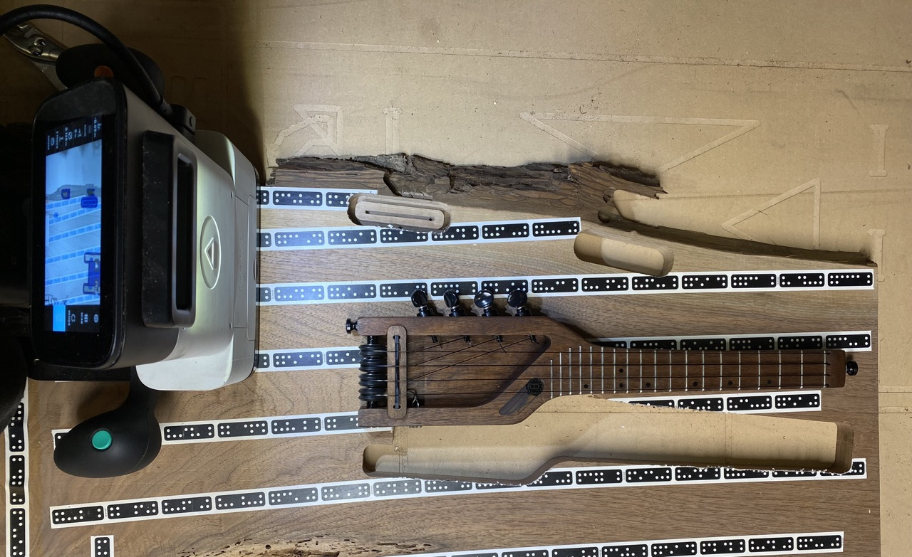
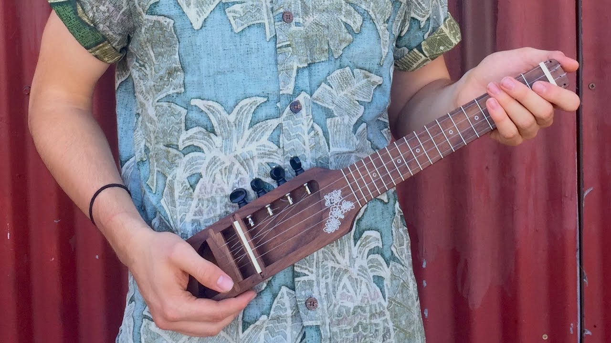
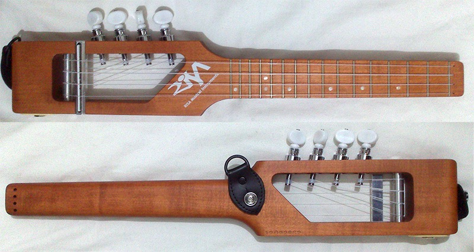
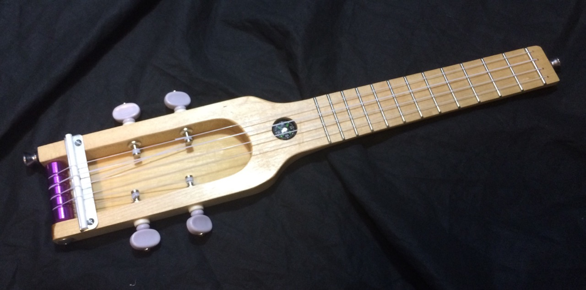
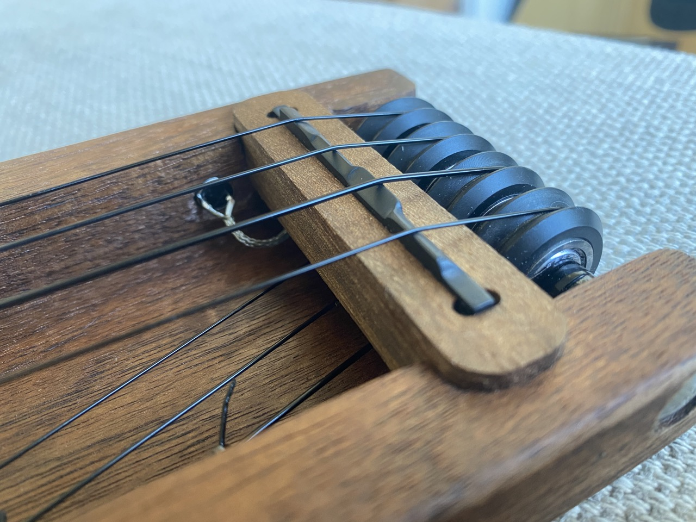
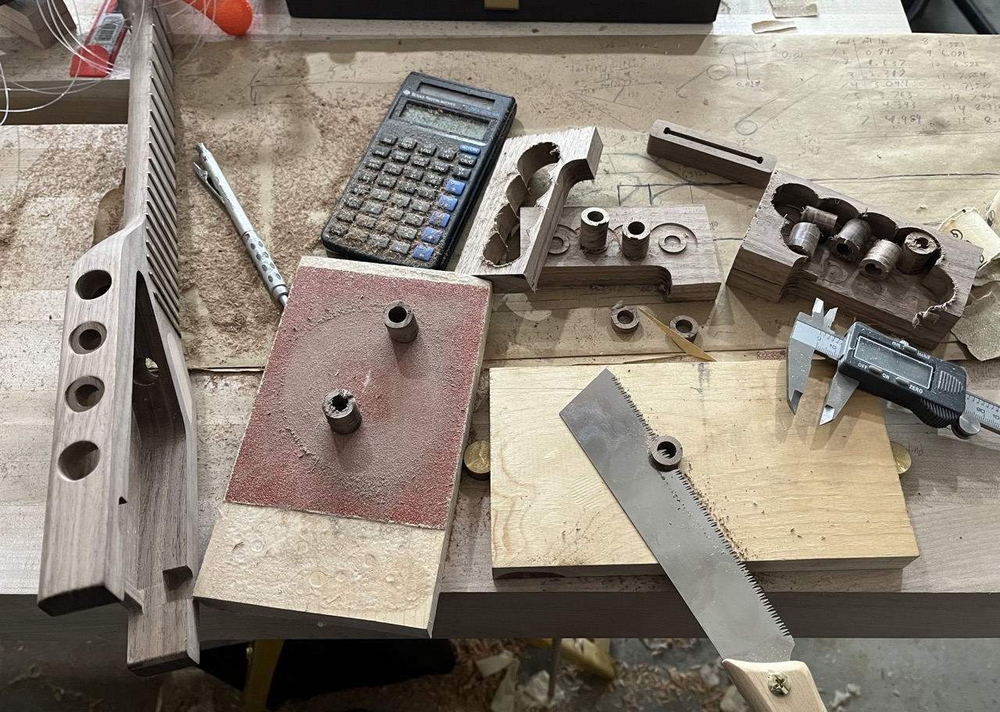
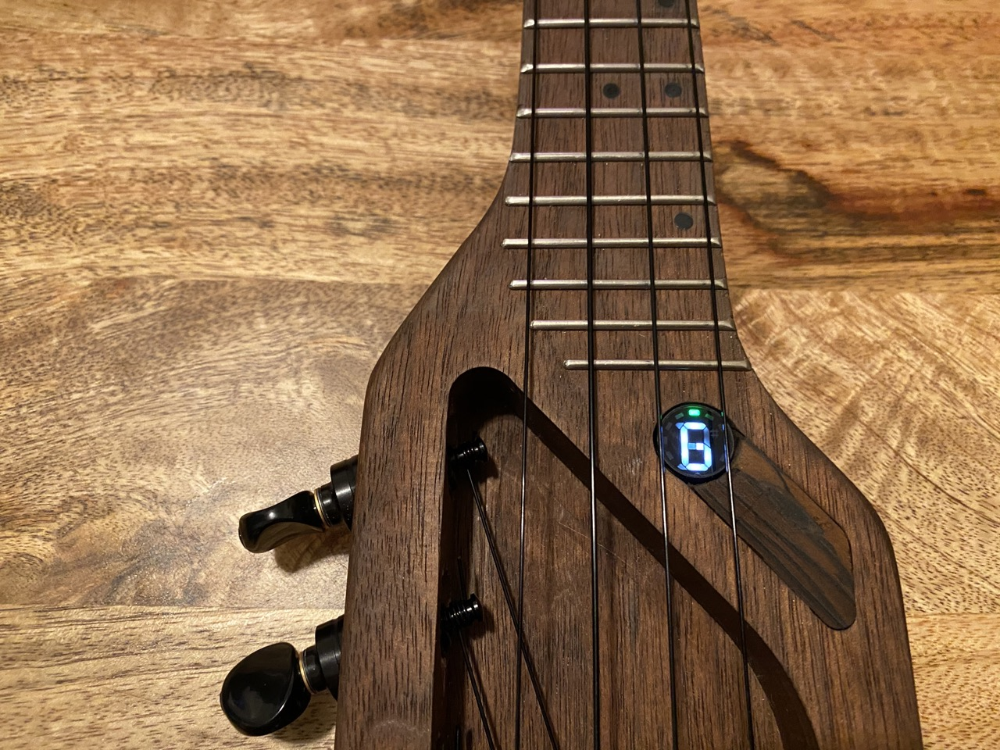
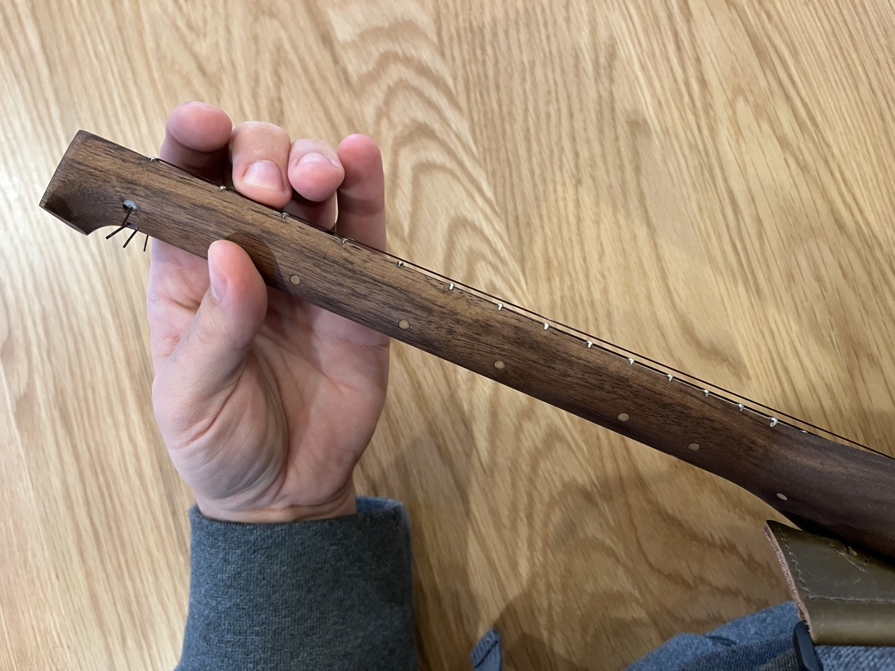
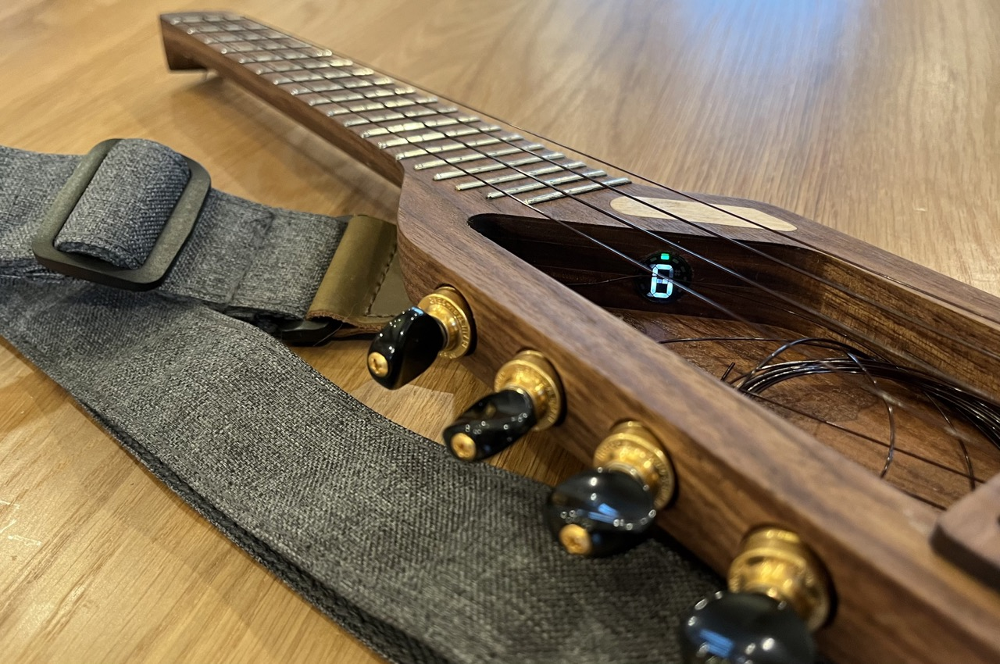

A while ago I made a travel ukulele for [Tanya](http://www.maybefriday.com)—and more recently another for [Nicole](http://nicoleaptekar.com)—and I figured I'd write about it in part because I think it went well but also because it was inspired by some other cool projects that deserve some cred.

## Shaper Origin demo

First and foremost, the Shaper demo. I backed the [Origin](https://www.shapertools.com/en-us/origin/overview) when it was on Kickstarter; at the time they sent demo units to some makers who in turn helped produce some sweet marketing videos about the process of using the tool and, of course, their results. One of them was [a travel ukulele](https://www.youtube.com/watch?v=Hirn_1BxHhk):

<iframe width="560" height="315" src="https://www.youtube.com/embed/Hirn_1BxHhk" title="YouTube video player" frameborder="0" allow="accelerometer; autoplay; clipboard-write; encrypted-media; gyroscope; picture-in-picture" allowfullscreen></iframe>

<!--

-->

I had to make one, and set off looking for more inspiration.

## [Risa Uke-Solid](https://www.ukulele.de/angebot/550/risa-uke-solid-soprano) (formerly Risa Stick)

The best known travel ukulele is probably the Risa Uke-Solid, which is pretty similar!

One thing I really like about the Risa is how the tuners are angled so the strings naturally wrap down the post of the tuning pegs. I'm not sure how the Shaper demo ukulele is to tune, but it was a one-off while the Risa is A Product that you can purchase, so the angle is probably useful. It also looks nice. I really like their use of a [zero-fret](https://en.wikipedia.org/wiki/Zero_fret) and the strap buttons are smartly-placed as well.

The cutout of the Risa goes all the way through, while the Shaper demo uke keeps a thin bit of wood in the back for resonance. Both look longer than they need to be—why extend the body beyond the strings? In the Risa's case it's to fit a full size ¼" jack in the butt, but I reckoned a ⅛" jack along the bottom somewhere would be just as good.

## [Circuits and Strings Backpacker Ukulele](https://circuitsandstrings.wordpress.com/2015/11/16/backpacker-travel-ukulele/)

This ukulele is truly only as long as it needs to be.

It's pretty roughly-built, but it was really close to the form factor I had in mind and that built-in compass was a really nice aesthetic touch.

Now obviously the compass is a gimmick; nobody is wayfinding out in the wilderness with a map in one hand and a ukulele balanced on the other, but you know what people with travel ukuleles _do_ need to do regularly? Tune their instrument! A bit of searching and I found the [Fender Bullet Tuner](https://www.fender.com/en-US/accessories/digital-tuners/fender-bullet-tuner/0239979002.html); a perfect built-in accessory for my travel ukulele.

## v1

I went a bit overboard making this thing. The tuning pegs are [really nice planetary units](https://theukulelesite.com/gotoh-upt-tuner-w-optional-install.html) (same as the Risa, I suspect), there's a [piezo rod](https://www.cbgitty.com/guitar-instrument-parts/1pc-ukulele-rod-piezo-pickup/) under the bridge, I used a gorgeous slab of black walnut and made an inlay out of its bark.

I hand-filed a TUSQ bridge intonated for high-G, and found [V wheels](https://openbuildspartstore.com/delrin-v-wheel-kit/) with bearings to minimize friction when tuning:

I [crowdsourced the ideal angle](https://twitter.com/numist/status/1210394543301939200) for my tuning pegs ([22.5°](IMG_1171.jpeg)), but using any angle other than 90° means getting creative with how the tuners are mounted. I have no idea how Risa did it, but I was able to get angled flat faces on both sides by boring a full size hole through the body and then gluing a hollow plug back in:

And, of course, it had to have that built-in tuner:

## v2

I also learned a lot, so when Nicole called asking about a ukulele that would fit in her Brompton's bag there were a couple things worth doing differently.

Shaping the neck was a lot of careful manual labour, but since moving across the bay I now had easy access to [Jesse](https://fsck.com) and his CNC (which is fully 3D while the Origin is best described as 2.5D), so we modeled and machined every contour of the ukulele. It was a huge improvement not only to the process of making the ukulele, but also the finished product—you can feel some lumps on the neck of Tanya's but Nicole's is bang on:

The tuner sticks out through the back side of Tanya's ukulele. This was intentional to leave access to the button and the screw cap for battery changes, but it also meant that the tuner got turned on (or off) whenever the ukulele was put down. On Nicole's ukulele we nestled the tuner across the body instead:

## Make your own

[Here's a zip of Origin-compatible SVGs for the v1 ukulele](ukulele%20svgs.zip), but I'd also encourage you to take the lessons I learned and make something that's all your own; I'd love to see what you come up with!
