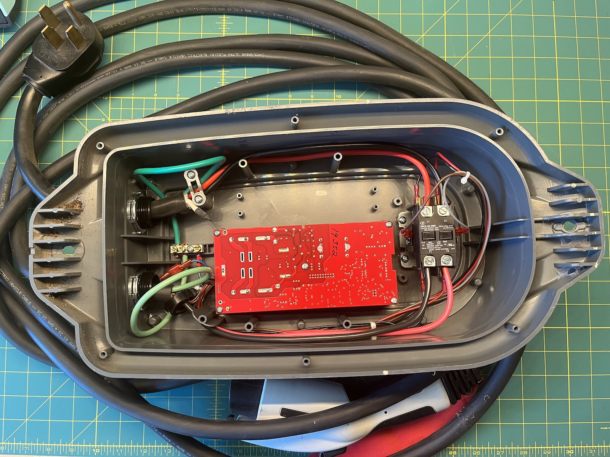
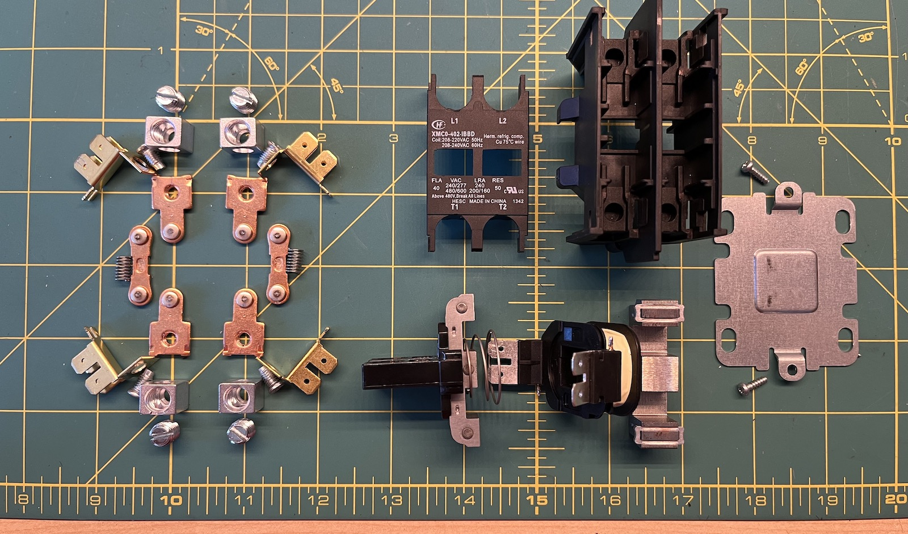
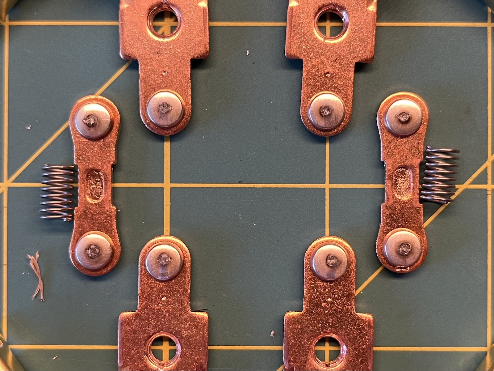
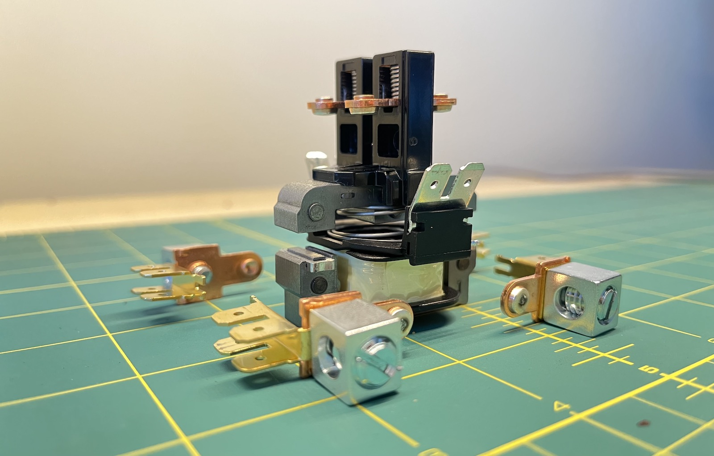

I've been using a secondhand Clipper Creek HCS-40P to charge my motorcycles for the last four years. Occasionally it would throw a fault, but it would (nearly) always work again after cycling the circuit breaker. But in the last year the faults have been getting more frequent and I've been wanting more reliability now that I've been using charging schedules (because our house has solar now).

I called tech support[^techsupport] and it turns out the Power Fault and Charging Fault lights blink an error code together; two blinks mean there's unacceptable resistance across the contactor. Basically, it's worn out. [As is tradition](/post/2022/reviving-a-Yamaha-PSS-A50/), it's time to look inside!

That black box on the right is the contactor, which basically operates like a big relay. The part number is XMCO-402-IBBD, but there are no domestic sellers so I played it safe and went with [an equivalent part that was in stock at Grainger](https://www.grainger.com/product/DAYTON-Definite-Purpose-Magnetic-6GNV0?opr=ILOF). It arrived the next day(!) and side by side the units look like they were made in the same factory—the mold seams and features on the enclosures appear identical.

Installation was pretty straightforward—the connections on the two contactors are exactly the same—and everything worked on the first try.

So let's see what the old contactor looks like inside!

The eight round lugs on the left side of the image are the parts that make contact (hence the name) and connect the charging cable directly to mains voltage. If we look closer, there's a bunch of pitting and wear from eight years of service. One could probably refurbish them by sanding them down to a nice clean finish but I already had the replacement on hand so I likely won't find out for another eight years or so.

And finally here's the parts together without the enclosure: basically the coil at the bottom draws the sprung assembly down, closing the two current paths up top and bringing the pair of E cores together[^cores].

[^techsupport]: Who were very helpful!
[^cores]: I'm not entirely sure why the core arrangement is so elaborate, maybe a reader can tell me? The lands definitely seem to serve as mechanical stabilization, but they could be made out of anything if that were their sole purpose. I presume it's to reduce coil current or improve magnetic force when closed (or both).
