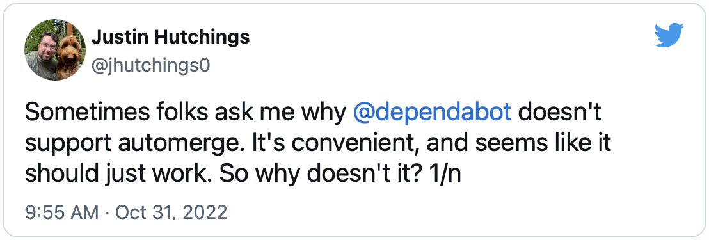

This blog uses a [GitHub Action](https://github.com/numist/numi.st/blob/main/.github/workflows/merge-dependabot.yml) to automatically merge pull requests from dependabot so long as the Netlify deploy preview check succeeds. It was a bit of a pain to get going[^unreliable], and always seemed like a process that GitHub could have made easier.

Of course, that was on purpose:

<!-- TODO: There's a blog post here about how frameworks are opinionated and friction should (and does!) get used to guide people towards more canonical code by design -->

<!-- <blockquote class="twitter-tweet">
Sometimes folks ask me why <a href="https://twitter.com/dependabot?ref_src=twsrc%5Etfw">@dependabot</a> doesn&#39;t support automerge. It&#39;s convenient, and seems like it should just work. So why doesn&#39;t it? 1/n
&mdash; Justin Hutchings (@jhutchings0) <a href="https://twitter.com/jhutchings0/status/1587126115218620417?ref_src=twsrc%5Etfw">October 31, 2022</a></blockquote>  -->

While I agree with Justin that researchers are more likely to audit packages than clients and supply chain attacks are worth solving, _Accelerate_[^accel] makes a compelling case that in the meantime it's better to deploy both good and bad packages faster than stall either. Besides, security-sensitive projects already know who they are and have integration processes for auditing dependency updates promptly; automerge is for the rest of us.

[^unreliable]: And it's constantly breaking.
[^accel]: Forsgren, Nicole, et al. [_Accelerate: The Science of Lean Software and DevOps: Building and Scaling High Performing Technology Organizations._](https://itrevolution.com/product/accelerate/) IT Revolution, 2018.