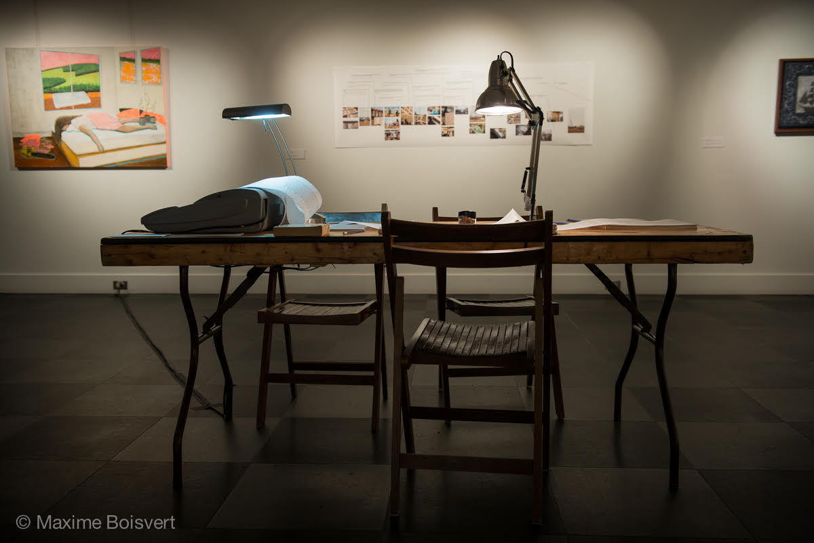

In 2010 I [turned a typewriter into a serial teletype for fun](http://numist.net/post/2010/project-typewriter.html), and for a Hack Week in 2013 I [made it print out tweets mentioning @Square](/post/2013/square-tweetwriter/). While fun, the noises it made were not compatible with an open office plan and it was retired at the end of the week.

In November 2014, a student named [Maxime Boisvert](https://maximeboisvert.com) reached out wanting to make his own teletypewriter for an art project. With my own at loose ends, I offered to ship it to him in Québec. A month later, another email:

> some news about my project with your typewriter.
>
> I’ve been selected to participate at an exhibition with other undergraduates at the Place des Arts de Montréal. To put it simply, the idea of my project is to generate text (an infinite poem) by using an algorithm inspired by the markov chains. The input text from which the poem is generated is made from the texts of two important and significant quebecers poets[^poets]. These two poets were in opposition in every aspect but are very symptomatic of what we are as quebecers, even now (they wrote their poems in 1930-1940). So by sending their poems through the Markov chains, I’m making an hybrid of their writings, I’m writing new poetry from their opposition. … The poem is generated live (we’ve created a code (a patchwork of codes in reality) that read the input text, create new text and send it through the serial port) and written continuously during the exhibition on a roll of paper. The public during the exhibition will be invited to participate in the process. They will be able to read part of the generated text, underline the parts they find nice or interesting (and date and sign their interventions) and at the end of the exhibition I’ll make a publication from all the underlined verses and include all the names of the people who participated in the project.

Very cool! It went well. Here’s a [blog post](https://maximeboisvert.wordpress.com/2014/12/11/regards-et-jeux-dans-les-iles-de-la-nuit-hybridation-st-denys-garneau-alain-grandbois-3/) from its first days, and [a portfolio page](https://maximeboisvert.com/Regards-et-jeux-dans-les-iles-de-la-nuit) with photos from the exhibition. Since then the typewriter has had a [few](https://www.agencetopo.qc.ca/wp/en/events/event/labsessions-8-2/) [more](https://www.agencetopo.qc.ca/wp/en/events/event/regards-jeux-iles-de-pensee-mecanique-maxime-boisvert-5-mai-19-juin-2016/) exhibitions, and you can even [buy a print](https://www.agencetopo.qc.ca/wp/en/regards-et-jeux-dans-les-iles-de-la-nuit/) of its human-annotated poetry.

The teletypewriter started life without a clear idea of what I wanted it to become, and Maxime gave it more purpose than I ever imagined. As a Canadian myself, knowing it's out there making interactive French Canadian art brings me joy.

A perfect end to my project, for it to be the beginning of someone else's.

<figure class="figure">
  
  <figcaption class="figure-caption text-end">© 2014 Maxime Boisvert, all rights reserved. Reproduced with permission.</figcaption>
</figure>

[^poets]: Saint-Denys Garneau and Alain Grandbois.
