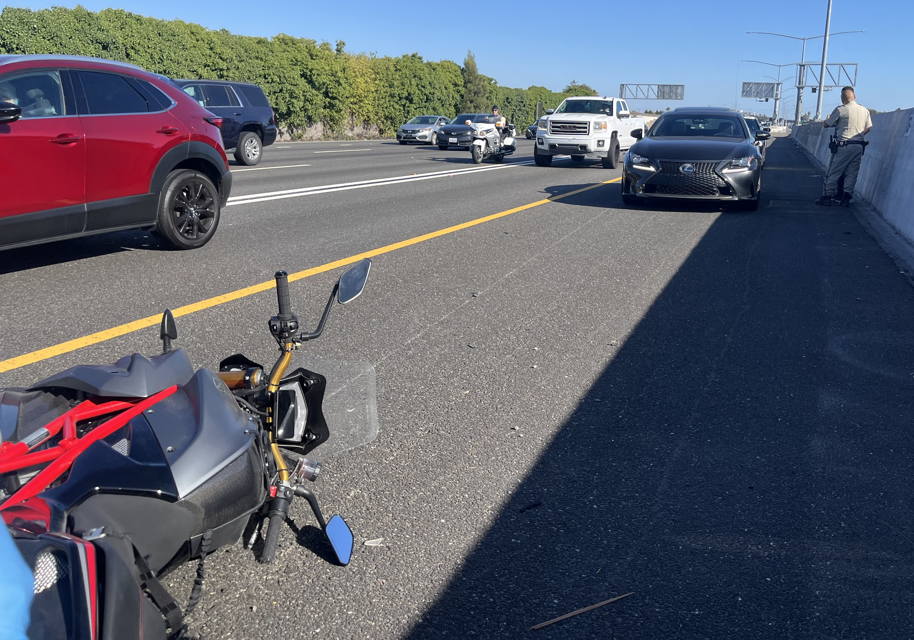

My commute home from work did not go as planned.

### Impact

The motorcycle's fork meets the car's rear tire, snapping the bars out of my hands with enough force to twist the frame. The front wheel locks up and my motorcycle becomes a catapult.

My airbag vest deploys an instant after I take flight. I have time to savour how it restricts my neck's mobility as I return to earth. I take a hard landing and a pretty short slide. Not ideal[^ideal].

### Secure scene

I move myself to the shoulder; it would really suck to get hit by two cars in a row. The bike's already there so I sit on its far side, a makeshift bollard crammed full of lithium cells.

### Assess injuries

I self-administer first aid[^wilderness]. <abbr title="Airway, Breathing, Circulation">ABC</abbr>. <abbr title="Alert and Oriented, ⁴⁄₄">A&Ox4</abbr>. <abbr title="Cervical spine">C-spine</abbr>. No apparent mortal injuries, my gear worked. I slip out of my suit and notice my left arm isn't right. Ugh, I'm going to miss my flight to Portland tomorrow.

### Make contact

I fish a phone[^phone] out of my tank bag and dictate the essentials to Tanya:



Wed, Aug 21 at 17:00

hit by car. I'm OK. I think my wrist is broken. Waiting for ambulance

    
Oh duck



### Police

CHP was on scene immediately, likely the same cruiser camped out looking for HOV violators that I'd passed just a moment before. If you're a local you know the spot. Surely they saw that Lexus crossing the double white?

"Do you know how fast you were going?"

No.

"65-70?"

Couldn't say.

"70 mph" shows up later in the crash report as if I'd volunteered the information myself. [Don't talk to the police.](https://www.youtube.com/watch?v=d-7o9xYp7eE)

### Medical

The medics on scene did their own assessment, were suitably impressed by my (relative) lack of injuries, and were very interested in my vest. They offered me my choice of destination, there being multiple Level I trauma centers in the area. Caught without having done any research, I chose "whatever's on the way home", which brought me to Eden Medical Center.

Notes from my <abbr title="History and Physical examination">H&P</abbr>:

> **CHIEF COMPLAINT:**
>
> Scott C Perry presents as a **Bravo Trauma Activation**
>
> Scott C Perry is a 39 year old male brought in by ambulance as a bravo Trauma Activation
>
> 39 year old male was involved in motorcycle accident. He was traveling at 60 mph[^allegedly], wearing helmet and full gear, that on impact inflates as a body airbag. He was able to ambulate on scene. He arrives awake with an abrasion to the right elbow and deformity to the left wrist.
>
> **ASSESSMENT AND PLAN**
>
> 39 year old male involved in motorcycle accident resulting in a left acute comminuted displaced fracture along the left distal radial metaphysis with dislocation.
>
> * Aspen cleared
> * Multimodal pain control
> * Close reduction and splinting in ER
> * Plan for definitive repair 8/22
> * Will admit

Turned out my wrist wasn't broken, just, uh,  "disassembled". A shot of fentanyl in my IV (and some local anesthetic) numbed things up enough to attempt a "reduction" but my wrist fell back apart immediately without the radius backing it up. Oh well. Trauma sent scans to orthopædics, who expressed concern about bone death and wanted to operate the following day.

But I did learn a new word[^search]!



<!-- wordid: 15548-->
com•mi•nut•ed |ˈkäməˌn(y)oōtəd| |ˌkɑmən(j)udəd| |ˌkɒmɪnjuːtɪd| adjective  technical   reduced to minute particles or fragments.   •  Medicine  (of a fracture) producing multiple bone splinters. ORIGIN  early 17th cent.: past participle of comminute, from Latin  comminut-  ‘broken into pieces,’ from the verb comminuere, from com-  ‘together’ + minuere  ‘lessen.’ 



That night and the following day were pretty rough, but I made it into the <abbr title="Operating Room">OR</abbr> less than 24 hours after my crash. Post-op note:

> **PRE-PROCEDURE DIAGNOSIS:**
>
> Left radial shaft fracture - highly comminuted 
> Left distal radial ulnar joint dislocation
>
> **POST PROCEDURE DIAGNOSIS:**
>
> same
>
> **PROCEDURE(S) PERFORMED:**
>
> Left radial shaft fracture - highly comminuted: open reduction and internal fixation 
> Left distal radial ulnar joint dislocation: closed reduction

A one hour operation turned into two[^estimates], but it was all good news when I woke up. There was no damage to my joints' surfaces, which should mean no injury-related arthritis down the line. I can expect to make a full recovery. In a year.

Discharged home that evening, I spent the next three days in bed with my arm elevated thinking of all the _stuff_ that needed to be done. I called my insurance company. Told my boss I'd need to work remotely for a little while. Located my motorcycle. Gathered wisdom from friends with relevant experiences.

What a mess.

[^ideal]: For the non-motorcyclists out there, you _want_ a long slide because it spreads your kinetic energy over time (and space). "Speed doesn't kill, _deceleration_ kills" may be technically correct, but [public roads are a _terrible_ place to take your chances](https://www.youtube.com/watch?v=VruWHHEnZGw).
[^wilderness]: Motorcycle crashes are why I got my wilderness first aid cert, though my intention was always to avoid being my own patient.
[^phone]: My work phone. The one in my pocket—_my_ phone—had run out of battery during the ride. I also switched over Find My. Still need to replace that battery.
[^allegedly]: For the record, I did not hazard any guesses about my speed to anybody—I don't look at my gauges when riding in murderous conditions, my speed was whatever I reckoned (accurately or not) as appropriate based on the traffic around me.
[^search]: If you're tempted to search the internet for this word, be advised that the results will include images that cannot be unseen.
[^estimates]: It's comforting to learn that estimates are the same in every field.
