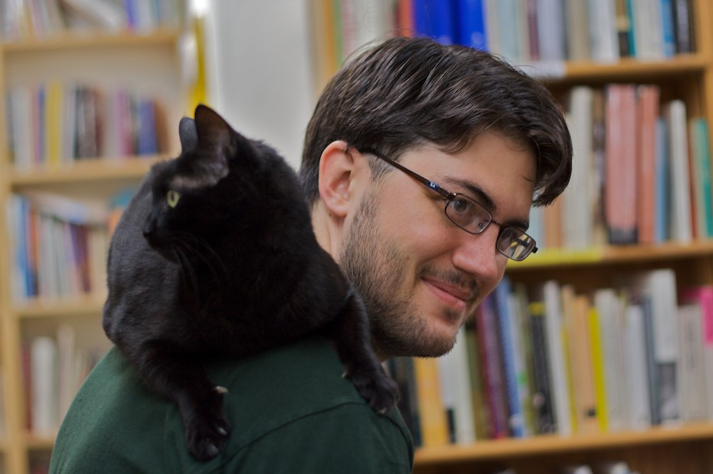

I had a major data loss event in 2013 and have been gradually piecing things back together since then. The data recovery has taken all forms, from hacking my iPod Mini to nursing data off the failing drives of a decommissioned server that a friend of mine ran under his stairs back when we were neighbours during university. Last night I accepted that there are no more photos to recover, which means I've lost almost all my photos from 2006[^350d] to 2012[^conn]. Tons of tmbo-era photography. All the raws from [my cross-country trip](http://numist.net/series/funemployment-cross-country-trip/). Basically all of college, since I stopped shooting film when I moved to San Diego. A chapter and a half of my life.

## What Happened?

I had been keeping it all on a Drobo, where it was supposed to be safe, but the redundancy of RAID5 was undermined by a different single point of failure: the device itself.

We have a much more robust strategy these days. I maintain a NAS at home[^rs] that acts as a backup target for our computers and syncs data from some of the cloud services we use. That NAS backs up nightly to a different NAS[^ds] that lives at my dad's house.

## Anyway

This post is a eulogy to the data lost. I have a couple photos that I'm going to be posting here soon, but many more will be missed. Here's one of the few survivors:[^exif]

This little guy adopted me at [Twice Sold Tales](https://www.twicesoldtales.com) on a visit to Seattle in July 2010. According to the owner of the shop, I matched the height and build of his previous human, who had recently died in a car crash. I still regret not taking him home with me.

[^350d]: When I got my Rebel XT
[^conn]: When I started using Aperture locally on a Mac Mini
[^rs]: A Synology RS1221+
[^ds]: My old Synology DS418
[^exif]: As I haven't written a photo view for the site yet, this was shot at ISO 200, 50 mm, ƒ/2.2, ¹⁄₆₀ s