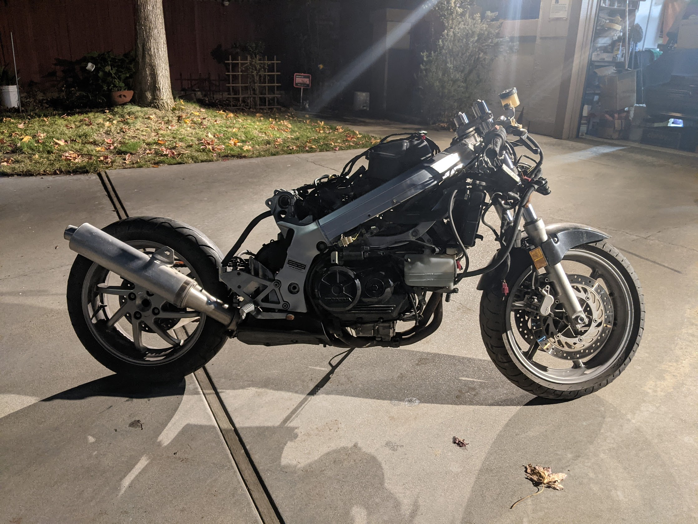
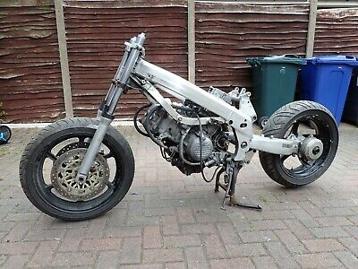
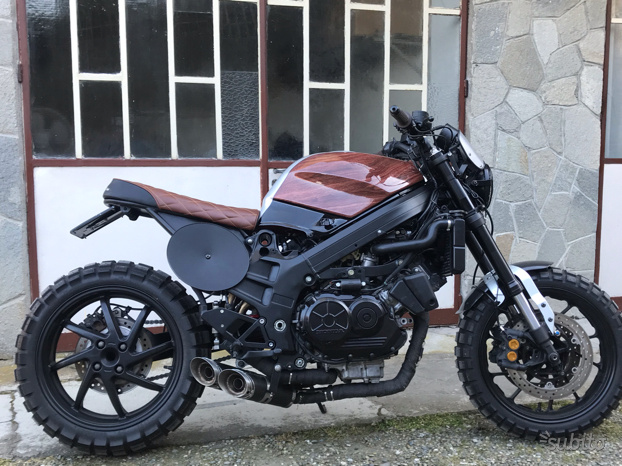
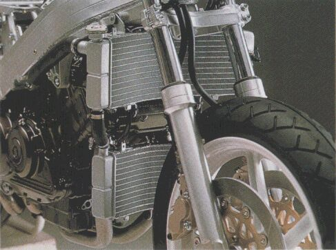

# TODO:

The immediate goal is to get this thing road-legal again so it can be ridden.

* Forks/controls
	* [ ] Custom radiator mounts (resolve fork interference)
	    * [ ] weld or tap steering stops onto lower triple
	* [ ] Switchgear reach
	* Front brake situation
		* [ ] Rotors
		* [ ] Pads
		* [ ] M/C from RC51 (consider RC51 clutch cyl to match? *oh the vanity*)
    * [ ] Resolve oil cooler interference ([notes](#oil-cooler))
* [ ] New air filter waiting at mgti
* [ ] Oil
* [ ] Coolant
* Refresh all hydraulics
    * [ ] Front brake M/C
    * [x] Front brake calipers
    * [ ] Clutch M/C
    * [ ] Clutch S/C
    * [ ] Rear M/C
    * [ ] Rear caliper
* Electrics
	* [ ] new battery
		* rear light situation
			* [ ] mounts
			* [ ] wiring/connectors (3c for tail, 2x2c for turn?)
		* front light situation
			* [ ] James to send [headlights](https://www.speedmotoco.com/Motorcycle-Projector-Headlight-Stacked-streetfight-p/projector-fya.htm) (or similar)
			* [ ] mounts
			* [ ] wiring/connectors (2x3c)
		* [ ] [instruments](#gauges)

Sections below are ordered rougly in order of operation, starting with the stuff that needs to get done _now_, followed by roughly two projects: improve aesthetics and improve power.

----

# Forks

[These people do low friction coatings](https://www.konflictmotorsports.com/suspension-store/ti-nitride-coating), in case that's useful someday.

I got a complete '01 RC51 SP1 front end. Only wrinkle is the fork offsets are different, so the VFR will have more trail than it started with. The rake on the RC51 was 24.5° ([source](https://www.motorcyclespecs.co.za/model/Honda/honda_rc51_sp2_06.html)) while the VFR is 26° ([source](https://www.motorcyclespecs.co.za/model/Honda/honda_vfr750f_90.html)), so keep that in mind while fettling. Probably the handlebar conversion will provide enough extra leverage that it won't matter.

In case steering stops (or trail changes) are too annoying:

> VFR1200 triple clamps (35mm offset vs 30mm offset for SP1)…on my 3rd gen the fork tubes hit these bosses on the frame without additional steering stops
> 
> There's no need to use a different lower bearing.  They use the same upper and lower bearings as the RC36, so no need to use a 3mm spacer (which is required to fit the CBR/RC51 SP1 lower yoke into the RC36 headstock.

And in case it's easier to buy than paint:

> The 929, 954 and RC51 all use the same front fender

There's also further [upgrade potential](https://www.rc51forums.com/threads/a-guide-to-ohlins-forks-front-suspension-for-the-rc51.39641/):

> The 30mm NIX cartridge kit is the most current Ohlins R&T front suspension option. However, for those who don't know, it is not a full Ohlins fork. It is a drop in kit for forks on current sportbikes. This kit replaces all of the internals on the OEM RC51 Showa forks. Amongst other internal changes (the kit is a full cartridge change), it uses 30mm Ohlins valving in place of the original 20mm Showa valves. Compression damping is found on the left fork leg while the right leg controls rebound damping. The main advantage of this setup is the ease of and speed in which spring changes can be made as well as other internal suspension tuning. Spring changes can literally take 8 minutes, which is very valuable in a racing environment. The compression adjusters on the bottom of the RC51 fork leg remain but are no longer used. Technically, Ohlins does not make this kit specifically for the RC51 as they don't normally provide new product for older bike platforms. However, Kyle USA has developed a custom kit that retrofits the Ohlins 30mm NIX cartridge kits into the OEM RC51 Showa forks. In order to retrofit the kit, custom extended fork caps are made by Kyle USA and used. That is why you see large black caps on the forks in pictures of this kit for the RC51.
> 
> The Ohlins 30mm NIX cartridge front suspension kit is generally considered to be the best option for people who want the ultimate performance, which is often on the track and in racing. Their performance in a racing environment is generally considered slightly better than even upgraded Ohlins FG832 and 322 forks. The aesthetics of the 30mm NIX upgrade are not as appealing to most people compared to the Ohlins FG832 and FG322 forks.

# Shock

[Jamie Daugherty does shock upgrades](http://daughertymotorsports.com/Backup/) and [sounds like he knows what's up](https://vfrworld.com/threads/vfr-750-1992-rear-shock-upgrade.40731/#post-385082). His best is a (re)built 929 shock. Phone is [+1 (260) 710-4049](tel:1-260-710-4049)

# Gauges

* [Trail Tech Vapor](https://www.trailtech.net/en-us/shop/accessories/digital-gauges/vapor-tachometer/) (cheap)
* [Daytona DEVA01](https://purposebuiltmoto.com/product/daytona-deva01-multifunction-cockpit/)
* [Koso TNT-04](https://kosonorthamerica.com/product/tnt-04-multifunction-meter/) (peaks at 10k )
* "Universal speedometer" chinesium stuff https://www.amazon.com/DKMOTORK-Motorcycle-Speedometer-Tachometer-Multi-function/dp/B07WW3L3Y8
homemade per IMG_4476 to IMG_4484

* CBR1000RR gauges can be made to work, and the bikes have the same redline (11.5)~

    > JACKPOT! Guys I did write it down. :wheel: Seeing gazman's schematic finally trigger one of my last functioning brain cells :beer: which let me recall that I enlarged the schematic and printed it in the hopes of reading it better. Anyway, I found that print out and I did label things. Starting from left to right on the above connector of the cbr1000rr gauge harness:
    > 
    > * CBR wire colors=function
    > * P= Speedometer (1)
    > * Br/W = Instrument lighting (switched)
    > * R/G= Instrument power (non-switched for clock, etc)
    > * Gr/Y= Not used (cbr steering damper)
    > * G= Ground
    > * Gr/R= Water temp
    > * Y/G= Tachometer
    > * Bu/R= Oil
    > * W/Bu= Not used (FI light)
    > * Br/W= Speedometer (2)
    > * Br/Bl= Fuel Reserve
    > * Lg/Bl= Neutral
    > * Lb= Right Turn
    > * Bl/Bu= High Beam
    > * O= Left Turn
    > * G/Bl= Speedometer (3)
    > * For the three speedometer sensor connections:
    > * CBR=VFR color wire
    > * Speedo (1)= Pink
    > * Speedo (2)= B/Br
    > * Speedo (3)= G/B
    > * Pink is the actual signal wire and the other two are power & ground.
    >
    > HTH and, oh yeah, disconnect battery before surgery! :wheel: Good luck :beer:

# Controls

Want RC51 clutch and front brake cylinders/levers

TSR clutch S/C from a CBR1000 for lighter feel?

RC51 RHS switchgear pls, would also need throttle (CBR1000 ist good)

[2008 HYPERMOTARD 1100S Genuine Knuckle Guard Set Mirror & LED Turn Signal](https://www.aliexpress.com/item/2251832705199667.html?gatewayAdapt=4itemAdapt)

----

# Misc

> the CBR900RR rearsets are the only direct bolt on replacement for the 4th gen that I know of

* [gas cap](https://www.vortexracing.com/product/gc210/)?
* [tank bag ring](https://sw-motech.us/products/luggage/tank+bags/EVO+tank+ring/4052572027516.htm)

# Bodywork and such

Untitled Motorcycle Company [did a VFR750](https://www.untitledmotorcycles.com/umc024-gambler) relatively early in their lives and it looks pretty damn sweet (they also [did a Zero](https://www.untitledmotorcycles.com/umc063-zero-xp-experimental) 😱). If I get to loose ends it might be worth asking them for help.

Not that I want any, but the tail will need… something? Airtech has a "[2VFR4
Honda VFR 750 Supersport tail section](https://www.airtech-streamlining.com/honda-fairings-seats-fenders-parts/VFR7501990-93.htm)" that I bet would be nice with the turn signal bulges lopped off.

## The fins are ugly

They could probably get cut off (set aside some waste material to weld back on as a gusset for reinforcing the shock tower). Someone chopped cymike's and it's rough but seems promising?

Compare to the 4th gen:

Alternately this bike stuck a number plate over the transition and it looks… okay? (I dig the underbelly mufflers)

Speaking of…

# Muffler

I would love to show off that rear wheel.

* [Tyga makes a full system!](http://tyga-performance.com/index.php?cPath=72_1036_1947_1949)
* undertail? (Akra CBR600? something that I can hide and pipe out between two headlights? or out the top?)
    * one extremely funny (though also pretty compromised) manifestation of this idea could involve extremely unequal length headers where the front cylinders' exhaust would come up the back of the engine following the path that the rear cylinders used to use to get down
* behind/below engine? ([Ex-Box](https://www.qdexhaust.it/en/catalog-qd-exhaust/ducati-en/monster-s4-en/ducati-monster-s4-ex-box-series-stainless-steel-exhaust-system/), [Leo Vince UNDERBODY](https://www.leovince.com/en-us/product/1811-2786-underbody-ktm-690-duke-lc4-2008-2011-2))

----

# Engine

Other than the [oil cooler](#oil-cooler), probably all this stuff should wait for a spare engine that can be built up and swapped in so the bike can remain rideable in the meantime. In brief, I want to get a 49 state build and fuel inject it.

* [Factory Pro - Pro Shift Kit](http://www.factorypro.com/Prod_Pages/prodh20.html)

## Oil cooler

~~I dunno why but I don't like the oil:air cooler. Wish it was oil:water like modern bikes. Apparently [the RC30 was this way?](http://www.rc30.info/rc30brochures.html):~~

> Two radiators are used, both are upgradable to HRC parts but only the larger upper radiator is really necessary. Water circulates through an oil cooler between the block and the oil filter, usually referred to as the 'oil heater' and discarded.
> 
> 

~~Begs the questions: does it have a different water pump with an extra oil cooler circuit? How were the [oil cooler lines dealt with](Sync%20Day.jpg) (can they just be capped)? What part is the pancake and will it fit? [This guy](https://rc30.yolasite.com/project.php) appears to have built an RC30 from parts he found and would probably know. evl_twin has two RC30s and would also know.~~

Seems like RC30 oil:water cooler parts are basically impossible to source so even if it would work it's probably cheaper (and definitely) easier to relocate the cooler, even if that means some fabrication.

I used [Pankey's Radiator Repair](https://pankeysradiator.com) to repair the Lightning's radiator and they were great; they do custom work, I should call them up and see if this is something they're interested in.

## De-California

Compared to the 49-state, [the California spec RC36 makes about 8hp and about 3.5lb/ft torque less across the whole rev range](https://vfrworld.com/threads/more-power-from-a-neutered-california-3rd-gen.33650/).

## CDI

How does spark work anyway?

>  The DENSO corp stick coils that Honda used on the CBR600RR were perfect for my projects

Is there room to go <abbr title="Coil-On-Plug">COP</abbr>?

## EFI

Squirt? 'duino?

Modify carbs, or find ITBs from a 600? (how to link them?)

Four barrel TB would be cute but the intakes aren't positioned favourably.

Wow, this solves the ITP MAP problem and provides a usable cam signal for port injectors in one neat package:

> A guy in Germany has developed a build-it-yourself, advanced Multiple-MAP-sensor unit that uses an Arduino Nano to monitor four MAP sensors (one for each cylinder on his ZX-7R).  The code loaded into the Arduino Nano looks at all four MAP sensor signals and determines which is pulling the most vacuum at any given microsecond.  Then the Nano forwards that signal to a Digital-to-Analog converter which is wired into the MicroSquirt's main MAP sensor input.  Also, the Nano knows which of the four MAP sensors is connected to cylinder #1, so whenever it sees that particular MAP sensor pull its highest vacuum it (the Nano) generates another digital output that mimics a camshaft position sensor (again out of the Nano as a digital signal, then through a DAC and on to the input on the MicroSquirt for camshaft position).

<!--
https://danstengineering.co.uk/GSXR-Individual-Throttle-Body-Spacing-Kit-to-suit-Ford-Zetec-CVH-92mm-Port-Spacing
Simpler to use GSXR TB's, they are seperate units on the late 90's ones, mounted like carbs on a rail, so would be better suited to fitting as replacements.
Probably a better option would be to use those from a CBR900RRY (929). They are similarly separate units, 40mm and also from Honda :-)
First of all I discovered that the 929 FireBlade seems to have 2 pairs, just like all the other Hondas and not the 4 separate units as I have seen stated and as I mentioned in a previous post in response to Mohawk. So whoever wrote that is simply wrong.
https://www.vfrdiscussion.com/index.php?/forums/topic/86822-rc362-4th-gen-fuel-injection-discussion/&do=findComment&comment=1075040
Aha, I've been thinking along those lines too, using the VFR750's carbs and I believe an early Kawasaki 900/1000 (I forget which) had a similar injector rail with suitable injectors. I've not discounted it and will be looking into that and the MicroSquirt for a similar project to inject a CBX1000 (6 cylinder), but that's further down the line. For this VFR750 I kinda want to make it as Honda as possible, so priority will be to see if I can use the 800 parts. If I can't use those TBs, I'll look for alternative TBs and if that fails, then it's modify carb time and a different ECU.
Maybe triumph 675 throttle bodies?
-->
